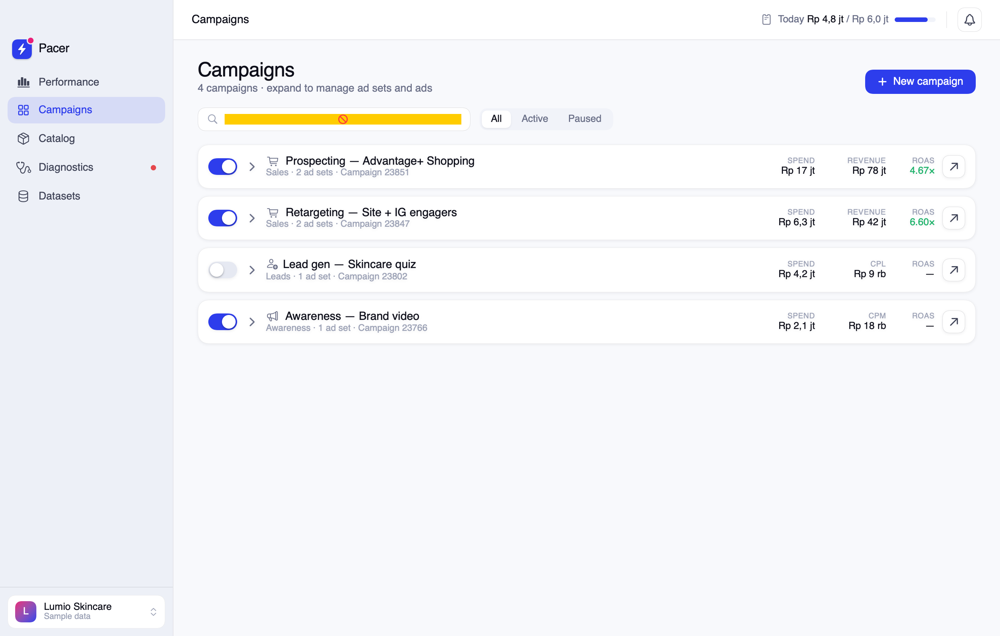
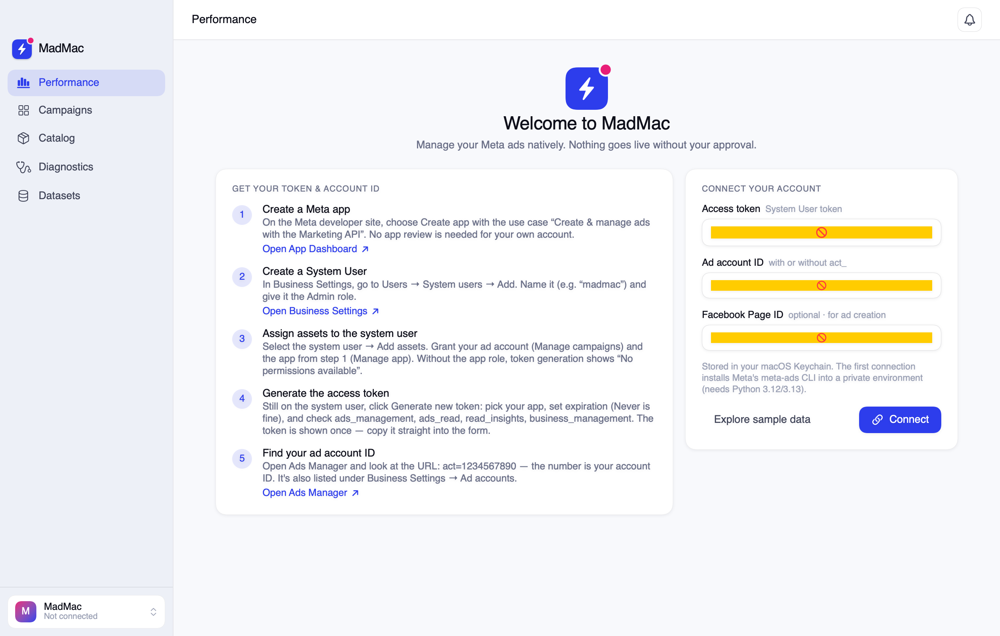
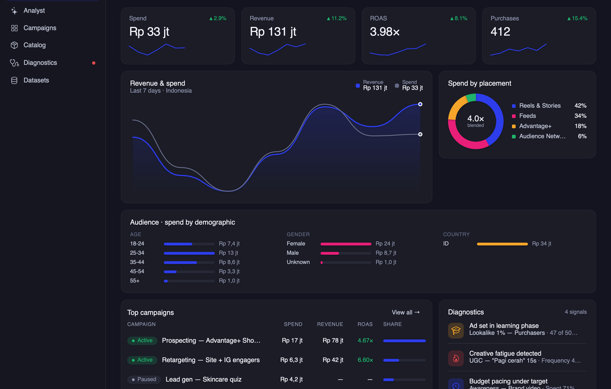

<p align="center">
  
</p>

<h1 align="center">MadMac</h1>

<p align="center"><b>Manage your Meta ads natively on macOS.</b><br>
A SwiftUI app for your Meta ad account — campaigns, insights, and a review-before-launch flow that makes sure nothing spends money without your explicit approval.</p>

---


## Why

Meta's Ads Manager is a heavy web app. MadMac is a real Mac app — sidebar, charts, switches, dark mode — talking to your ad account through the Meta Marketing API.

## The hero flow: review before launch

Nothing touches your ad account until you approve it.

Flipping any status switch or finishing the create wizard **stages** the change. A floating bar shows what's staged; *Review & launch* opens the launch plan — a spec tree for new campaigns and before→after diffs for status changes — gated behind **Approve & launch**. New campaigns are always created `PAUSED` unless you explicitly toggle *Launch active now*.


## Features

- **Performance dashboard** — KPI cards with 7-day deltas and sparklines (spend, revenue, ROAS, purchases, CPA, CTR, reach, CPM), a revenue/spend chart, top campaigns, and a diagnostics feed. Three switchable layouts: Overview, Spotlight, Table.
- **Campaigns** — an expandable campaign → ad set → ad tree with per-row metrics, learning-phase badges, search and status filters, a detail drawer, and a 3-step create wizard.

  

- **Catalog, Diagnostics, Datasets** — product performance, account-health signals, and pixel events.
- **Onboarding that actually onboards** — a step-by-step guide to creating a Meta app, a System User, and a properly-scoped access token, with deep links into the right Meta dashboards.

  

- **Mayar design system** — Plus Jakarta Sans, brand blue/magenta, full light & dark token sets, four accent colors, and density settings (⌘,).

  

## Connecting your account

MadMac opens with the onboarding guide. In short:

1. Create a Meta app ([developers.facebook.com/apps](https://developers.facebook.com/apps)) with the *Marketing API* use case.
2. In [Business Settings](https://business.facebook.com/settings), create a **System User** (Admin) and assign it your **ad account** and the **app**.
3. Generate a token with `ads_management`, `ads_read`, `read_insights`, `business_management`.
4. Your ad account ID is the `act=…` number in the [Ads Manager](https://adsmanager.facebook.com) URL.
5. Paste both into MadMac.

The token is stored in the **macOS Keychain** — it never touches disk in plain text. The first connection sets up a private helper environment in `~/Library/Application Support/MadMac/` (needs Python 3.12 or 3.13, e.g. `brew install python@3.13`).

Prefer to look around first? *Explore sample data* loads a fictional account with realistic numbers.

## Building

```sh
brew install xcodegen
xcodegen generate
xcodebuild -project MadMac.xcodeproj -scheme MadMac -configuration Release build
```

Requires macOS 14+ and Xcode 16+.

### Debug helpers

```sh
MadMac --snapshot /tmp/shots          # render every screen to PNG (ImageRenderer)
MadMac --connect <token> <account_id> # store credentials from the terminal
MadMac --live-check                   # exercise the live pipeline headlessly
```

## How it talks to Meta

`AdsBackend` protocol with two implementations:

- **SampleBackend** — the bundled demo dataset.
- A **live backend** against the Marketing API, with per-campaign insight queries capped to respect the ~200 calls/hour rate limit and currency-offset handling verified against a real account (IDR and 14 other currencies have no minor units in the Marketing API).

Every write the app can issue lives in [`Sources/Backend/CLIBackend.swift`](Sources/Backend/CLIBackend.swift): campaign/ad set/ad status updates, and campaign creation (always `PAUSED` unless approved live).

## Design

Implemented from a Claude Design handoff bundle ("Pacer — Meta Ads for Mac") on the Mayar design system: Plus Jakarta Sans (bundled), brand blue `#2D3DEC` / magenta `#E91E78`, ported to SwiftUI with full light/dark token sets. Charts are hand-rolled SwiftUI `Path`s — no dependencies. Built with [Claude Code](https://claude.com/claude-code).

## License

[MIT](LICENSE) — the bundled Plus Jakarta Sans font is licensed separately under the [SIL Open Font License](https://fonts.google.com/specimen/Plus+Jakarta+Sans/license).
