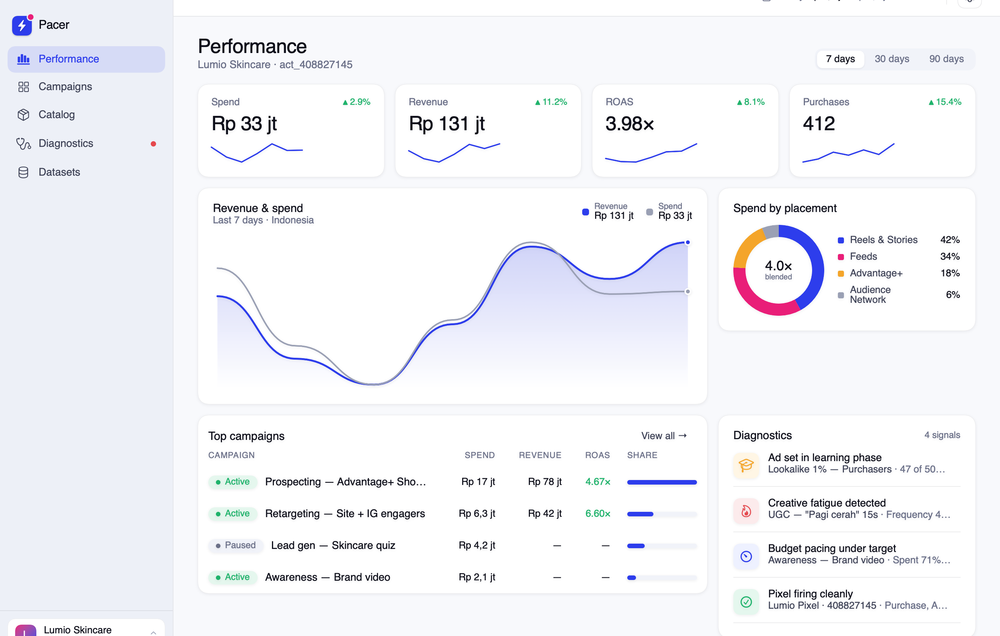
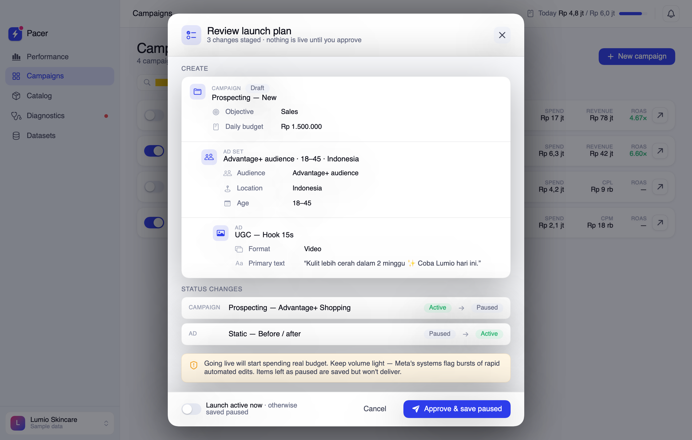

# Pacer — Meta Ads for Mac

A native macOS app for managing Meta (Facebook/Instagram) ad campaigns, built with SwiftUI on the Mayar design system. Pacer is a GUI on top of Meta's official [Ads CLI](https://developers.facebook.com/documentation/ads-commerce/ads-ai-connectors/ads-cli/ads-cli-overview) (`meta-ads` on PyPI) — the CLI is invisible plumbing; you get panels, charts, and switches.



## The hero flow: review before launch

Nothing touches your ad account until you approve it. Flipping any status switch or finishing the create wizard *stages* the change. A floating bar shows what's staged; **Review & launch** opens a launch plan — a spec tree for new campaigns and before→after diffs for status changes — gated behind **Approve & launch**. New campaigns are created `PAUSED` by default (mirroring the ads-cli) unless you toggle *Launch active now*.



## Sections

- **Performance** — KPI cards with 7-day deltas and sparklines, revenue/spend chart, placement donut, top campaigns, diagnostics feed. Three layouts (Overview / Spotlight / Table) switchable in Settings.
- **Campaigns** — expandable campaign → ad set → ad tree with per-row metrics, learning-phase badges, search and status filters, a detail drawer, and a 3-step create wizard.
- **Catalog** — product stats and top products by ad ROAS.
- **Diagnostics** — account health score and delivery signals.
- **Datasets** — pixel events, match quality.

Light/dark mode, four accent colors, and density options in Settings (⌘,).

## Connecting a real account

Pacer starts in **sample mode** (a fictional Indonesian DTC account). To connect a real account:

1. Create a System User in Business Manager (or use Graph API Explorer) and generate an access token with `ads_management`, `read_insights`, `business_management`.
2. In Pacer: account card (bottom-left) → **Connect Meta account…**, paste the token + ad account ID.
3. The first connection creates a private Python venv in `~/Library/Application Support/Pacer/` and installs the `meta-ads` CLI (needs Python 3.12+, e.g. `brew install python`).

Credentials are stored in the macOS Keychain and passed to the CLI via environment variables only.

## Building

```sh
brew install xcodegen
xcodegen generate
xcodebuild -project Pacer.xcodeproj -scheme Pacer -configuration Release build
```

Debug helper: `Pacer --snapshot /tmp/shots` renders every key screen to PNG.

## Design

Implemented from a Claude Design handoff bundle (“Pacer — Meta Ads for Mac”): Mayar design tokens (Plus Jakarta Sans, brand blue `#2D3DEC` / magenta `#E91E78`), ported to SwiftUI with full light/dark token sets.
